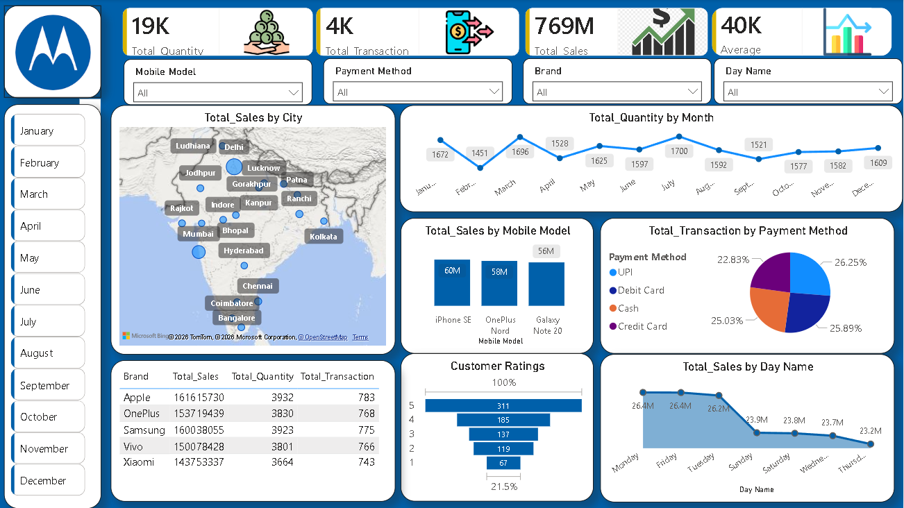

# Mobile Sales Business Intelligence Dashboard

## 1. Project Title
An end-to-end Power BI analytics project built to transform raw sales data into meaningful business insights. The dashboard provides visibility into sales performance, customer ratings, transaction methods, regional trends, and brand-wise comparisons through interactive and visually engaging reports.

## 2. Short Description
The Mobile Sales Analytics Dashboard is a business intelligence solution built in Power BI to transform raw mobile sales data into actionable insights. The dashboard enables users to monitor sales performance, analyze customer purchasing patterns, compare brand performance, evaluate payment preferences, and track monthly sales trends through interactive visualizations. This project demonstrates how data can be leveraged to support strategic decision-making and improve overall business performance.

## 3. Tech Stack
The dashboard was built using the following tools and technologies:

* 📊 Power BI Desktop – Used to design and develop interactive dashboards and visualizations.
* 📂 Power Query – Utilized for data extraction, cleaning, transformation, and preparation.
* 🧠 DAX (Data Analysis Expressions) – Created calculated measures, KPIs, aggregations, and business metrics.
* 🔗 Data Modeling – Established relationships between sales, customer, product, and transaction datasets to enable accurate analysis and cross-filtering.
* 📈 Data Visualization – Implemented maps, line charts, bar charts, pie charts, KPI cards, slicers, and tables to present business insights effectively.
* 📍 Bing Maps Integration – Used for geographical analysis of sales performance across cities.
* 📁 File Formats – .pbix for dashboard development and .png for dashboard previews and documentation.

## 4. Data Source
Source: Kaggle – Mobile Sales Data

The dataset contains mobile phone sales transactions across multiple cities, brands, and payment methods. Key attributes include product details, sales revenue, transaction counts, customer ratings, quantities sold, and geographical information.

The data was processed using Power Query and modeled in Power BI to support interactive analysis of sales trends, customer preferences, and business performance metrics.

## 5. Features

### 📌 Business Problem
Mobile retailers generate thousands of sales transactions across multiple cities, brands, and payment channels. However, identifying top-performing products, understanding customer preferences, tracking sales trends, and evaluating business performance can be challenging when data is scattered across raw transaction records.

Business stakeholders need a centralized and interactive solution to quickly answer questions such as:

* Which mobile brands generate the highest revenue?
* Which cities contribute the most to overall sales?
* What payment methods are preferred by customers?
* How do sales and quantities vary throughout the year?
* What factors influence customer satisfaction and ratings?

### 🎯 Goal of the Dashboard

The Mobile Sales Analytics Dashboard was developed to provide a comprehensive view of sales performance and customer behavior through interactive visualizations.

The dashboard enables users to:

* Monitor key sales KPIs in real time.
* Analyze brand and product performance.
* Identify geographical sales trends.
* Understand customer payment preferences.
* Evaluate customer satisfaction through ratings.
* Support data-driven business decisions.

### 📊 Walkthrough of Key Visuals

#### KPI Cards

Provides a high-level overview of business performance:

* Total Quantity Sold: 19K
* Total Transactions: 4K
* Total Sales: 769M
* Average Sales Value: 40K

#### Monthly Filter Panel

Allows users to analyze sales performance for specific months and identify seasonal trends.

#### Total Sales by City (Map Visual)

Displays city-wise sales distribution across India, helping identify high-performing and low-performing markets.

#### Total Quantity by Month (Line Chart)

Tracks monthly sales volume trends and highlights periods of high and low demand.

#### Total Sales by Mobile Model (Bar Chart)

Compares revenue generated by different mobile models to identify best-selling products.

#### Transactions by Payment Method (Pie Chart)

Shows customer payment preferences across UPI, Debit Card, Credit Card, and Cash transactions.

#### Brand Performance Table

Provides a detailed comparison of brands based on:

* Total Sales
* Total Quantity Sold
* Total Transactions

#### Customer Ratings Funnel

Analyzes customer satisfaction levels and rating distribution.

#### Sales by Day of Week

Highlights purchasing behavior across weekdays and weekends to uncover peak sales periods.

### 💡 Business Impact & Insights

* Identify top-performing brands and mobile models to optimize inventory planning.
* Understand customer payment preferences to improve payment experience and promotional campaigns.
* Detect high-revenue cities for targeted marketing and expansion strategies.
* Monitor monthly sales trends to support forecasting and demand planning.
* Analyze customer ratings to improve product offerings and customer satisfaction.
* Enable management teams to make faster, data-driven decisions using a single interactive dashboard.

## 6. Screenshots

